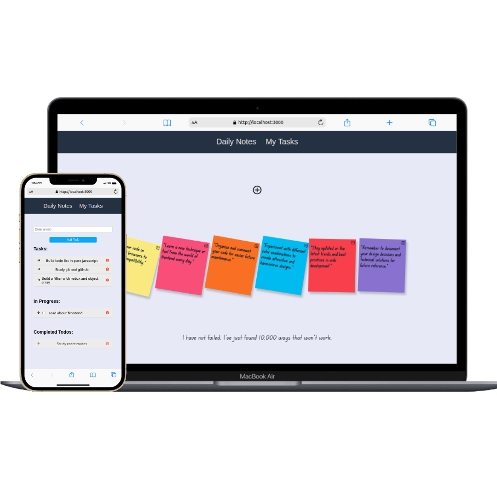

# Productivity Notes

  

This project is a productivity website that allows users to add notes and tasks to manage their daily activities. It was developed using JavaScript, ReactJS, CSS, and Firebase. Notes are saved locally in the user's browser using LocalStorage, while the task list is stored in Firebase.

## Technologies Used

- React
- JavaScript
- Firebase
- CSS

## How to Run

1. Make sure you have Node.js installed on your system.
2. Clone this repository using the following command: git clone https://github.com/Aleikson/ExampleOfEcommerce.git
3. Navigate to the project directory:
4. Install the project dependencies:
5. Start the development server:
6. Open your browser and access the following URL: http://localhost:3000

## Contact

Aleikson - [aleiksonsilva@hotmail.com](mailto:aleiksonsilva@hotmail.com)
